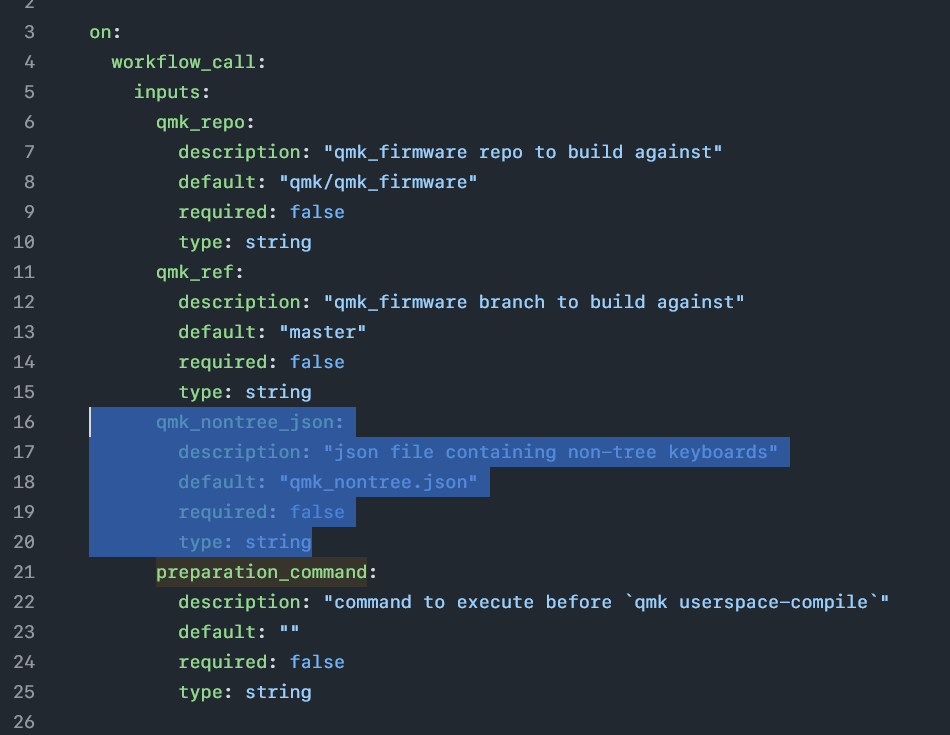
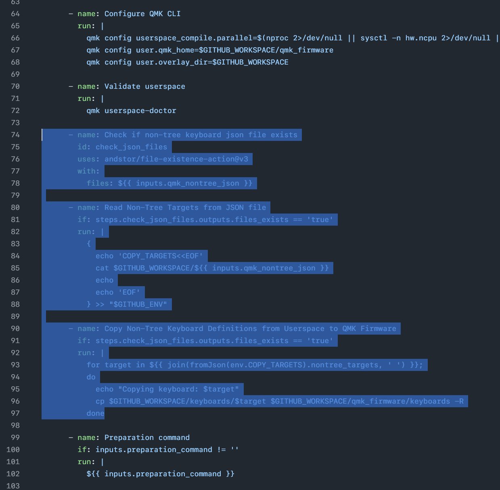
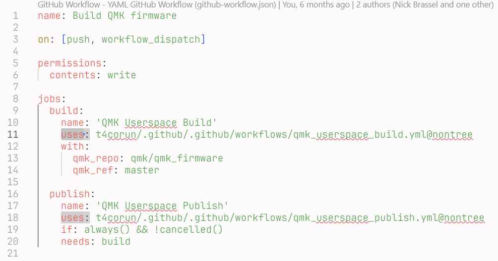

# T4CORUN Userspace

My External Userspace to build QMK firmware through GitHub Actions

## Layout

The custom layout optimizes for programming (SQL, Powershell, C) and minimizes holds for comfort. It started from [Manna Harbor Miryoku](https://github.com/manna-harbour/miryoku) and took heavy influence from [Jonas Hietala T-34](https://www.jonashietala.se/series/t-34/). Themes:

- Keymap targets split 3x5 boards with five thumb keys (three left and two right) and integrated pointing device.
- Optional support for
  - Dual encoders. Favor the right side encoder when there is only one
  - Keyball39's four extra keys
  - tight integration with a Ploopy Nano Trackball
- Releasing all keys always brings you back to base layer
- Layers are designed orthogonally with a single purpose per hand and are accessed by holding a thumb key on the opposite hand
- Reworking Symbols for programming focus
  - Common symbols are positioned under stronger fingers
  - Custom behavior from holds
- Advanced macros to minimize/simplify layers


## Target Keyboards

QMK Tree Keyboards

- Bastardkb Charybdis Nano 3x5
- Planck Rev6
- Ferris Swoop
- DZRGB60v2 (coming)
- Crkbd 3x6 (deprecated)
- Ploopy Nano

Non Tree Keyboards

- Keyball39
- KLOR Saegewerk
- Rollow

## How to Build

Since I have keyboards that are not part of QMK Firmware (e.g. Keyball39) I need to take extra steps to build these. Below are instructions on how to do this either through Github Actions or your local build environment.

### via GitHub Actions

This method will enable one to build firmware without a local build environment on their computer. The GitHub Actions have been extended to copy keyboard definitions from your userspace to the build container's keyboards folder before compiling. These steps assume you already have an external userspace configured

1. Fork [qmk/.github](https://github.com/qmk/.github) to your Github account
2. Create a branch `nontree`
3. Edit `/.github/workflows/qmk_userspace_build.yml`
4. Paste the below to add another configuration file to tell which folders to copy from your userspace to the build container: `qmk_nontree.json`

    ```yaml
    qmk_nontree_json:
      description: "json file containing non-tree keyboards"
      default: "qmk_nontree.json"
      required: false
      type: string
    ```

    

5. In the same file, paste the below after the `validate userspace` step. This will

    ```yaml
    - name: Check if non-tree keyboard json file exists
      id: check_json_files
      uses: andstor/file-existence-action@v3
      with:
        files: ${{ inputs.qmk_nontree_json }}

    - name: Read Non-Tree Targets from JSON file
      if: steps.check_json_files.outputs.files_exists == 'true'
      run: |
        {
          echo 'COPY_TARGETS<<EOF'
          cat $GITHUB_WORKSPACE/${{ inputs.qmk_nontree_json }}
          echo
          echo 'EOF'
        } >> "$GITHUB_ENV"

    - name: Copy Non-Tree Keyboard Definitions from Userspace to QMK Firmware
      if: steps.check_json_files.outputs.files_exists == 'true'
      run: |
        for target in ${{ join(fromJson(env.COPY_TARGETS).nontree_targets, ' ') }};
        do
          echo "Copying keyboard: $target"
          cp $GITHUB_WORKSPACE/keyboards/$target $GITHUB_WORKSPACE/qmk_firmware/keyboards -R
        done
    ```

    

6. Back in your userspace, edit `.github\workflows\build_binaries.yaml`. Change the repository/branch paths for the two steps so the workflow will use your modified files. Pay attention to your GitHub username at the front and the branch name at the end

    ```yaml
    uses: t4corun/.github/.github/workflows/qmk_userspace_build.yml@nontree
    uses: t4corun/.github/.github/workflows/qmk_userspace_publish.yml@nontree
    ```

    

7. Create a file `qmk_nontree.json` in your userspace root directory, paste the following contents, and customize to your needs. Each line represents a folder in your userspace `keyboards` folder

    ```json
    {
    	"nontree_targets": [
            "non_tree",
    		"ploopyco"
    	]
    }
    ```

8. Configure your build targets `qmk.json` and build away

### via Local Build Environment

Like the above, we will be copying our non-tree keyboard definitions to `qmk_firmware\keyboards` before compiling. These steps assume you already have a local build environment configured.

1. In a bash terminal, run the following command to copy your custom keyboard definitions to your qmk_firmware directory

    ```bash
    # alter the source userspace path and target qmk_firmware path as needed
    cp -r /d/Repo/qmk_userspace/keyboards/non_tree /d/Repo/qmk_firmware/keyboards/.
    ```

2. Compile your firmware as normal

    ```bash
    # build keyball39 firmware
    qmk compile -kb non-tree/keyball39 -km t4corun
    ```

## Notable Features

Quick summary of features. Some of these can be enabled/disabled if they are not needed and/or fit on smaller MCUs

- Tri-Layer: Hold both thumb momentary layer keys `NAVIGATION` and `NUMBER` to access the `SYMBOL` layer
- One Shot Mods: Minimizes holding, simplify layers, and avoid misfires from having Home Row Mods. Implemented bi-lateral GACS mods.
- Caps Word: enables temporary all-caps typing without holding shift. Useful to typing programming variables. Tap `shift` twice to enable this.
- RGB Matrix: see RGB lighting effects for large MCU memory footprints. Configuration in `config.h` preprocessor definitions
- Pointing Device: for trackball functionality on certain boards (e.g. Keyball39 and Bastardkb Charybdis Nano). Note `MOUSEKEY_ENABLE` do not need to be enabled get the mouse click buttons.
- OLED Displays: Enables keyboard status visualization. Display active layers, modifiers, host state, and feature status. Shows Pointer CPI and RGB values. Support for 128x32 or 128x64 screens

Additional features below

### Layout Wrapper Macros

A single keymap layout can be shared with multiple keyboards by using C preprocessor macros. These macros are referenced in the keyboard JSON files, and the build process will expand them into a transient keymap.c file during compile time.

In this userspace, my keymap can adapted for various split keyboards by adding/removing keys with macros. For example, there is a wrapper that will add the outer columns for a Corne's 42-key 3x6_3 layout.

### Ploopy Nano Integration

When enabled, use host state LED macros to allow the keyboard to control Ploopy Nano function.

| Press on Keyboard        | Result on Ploopy Nano            | Comment                                                    |
| ------------------------ | -------------------------------- | ---------------------------------------------------------- |
| Scroll Lock              | momentary Drag Scrolling         |                                                            |
| Num Lock                 | switches DPI                     |                                                            |
| Scroll + Num + Caps Lock | puts Ploopy Nano into bootloader | See [Toggle Configuration](#toggle-configuration) for this |

### Tap-Holds

Certain keys have different behaviors when held vs tapped allowing commonly typed programming syntax or shifting certain keycodes without actually pressing/holding shift. Opted to implement overrides here instead of using built-in Key Override functionality because this implementation does not require pressing/holding shift to get the alternate key

| Keycode   | When tapped | When held               | Comments                          |
| --------- | ----------- | ----------------------- | --------------------------------- |
| `TR_LBRC` | `[`         | `[]` with cursor inside |                                   |
| `TR_LABK` | `<`         | `<>` with cursor inside |                                   |
| `TR_LPRN` | `(`         | `()` with cursor inside |                                   |
| `TR_SQUO` | `"`         | `""` with cursor inside |                                   |
| `TR_SQUO` | `'`         | `''` with cursor inside |                                   |
| `TR_BSLS` | `\`         | `\\`                    |                                   |
| `TR_SLSH` | `/`         | `//`                    |                                   |
| `TR_PIPE` | `\|`        | `\|\|`                  |                                   |
| `TR_COMM` | `,`         | `(`                     | enables parenthesis on base layer |
| `TR_DOT`  | `.`         | `)`                     |                                   |
| `TR_PERC` | `%`         | `^`                     |                                   |
| `TR_EQL`  | `=`         | `+`                     |                                   |
| `TR_MINS` | `-`         | `_`                     |                                   |
| `TR_GRV`  | `backtick`  | `~`                     |                                   |
| `TR_SCLN` | `;`         | `:`                     |                                   |
| `TR_QUOT` | `'`         | `"`                     |                                   |

### Combos

Enables additional keys to be mapped by pressing multiple keys simultaneously. Primarily used to enable mouse functionality on base layer

| Combo           | Result                     | Comment |
| --------------- | -------------------------- | ------- |
| `X` + `V`       | Drag Scroll Hold           |         |
| `NUM` + `Shift` | Momentary `FUNCTION` Layer |         |

### Advanced Encoder Functionality

- Super Tabbing: in the `NUMBER`, the encoder will send `Tab` and `Shift + Tab`. Holding `alt` or `ctrl` while turning the encoder will allow Window or Browser tab switching. Active on 
- Zoom: the encoder will send `Ctrl + Mouse Wheel Up` and `Ctrl + Mouse Wheel Down` without having to hold modifiers

### Super Configuration Macros

Implemented custom macros which enable modifiers to change output. This allows us to combine all the QMK configuration change macros into three keys. These can be used with encoders too.

#### Increment/Decrement configuration

| Held Modifier      | Increase (`FWD_CFG`) or Decrease (`REV_CFG`) |
| ------------------ | -------------------------------------------- |
| None               | nothing                                      |
| Shift              | RGB Matrix Hue                               |
| Ctrl               | RGB Matrix Sat                               |
| Alt                | RGB Matrix Brightness                        |
| Gui                | RGB Matrix Animation Speed                   |
| Shift + Ctrl       | RGB Matrix Animation                         |
| Ctrl  + Alt        | Audio Click Frequency                        |
| Shift + Ctrl + Alt | Haptic Feedback Mode                         |

#### Toggle Configuration

| Held Modifier      | Toggles (`TOG_CFG`)                          |
| ------------------ | -------------------------------------------- |
| None               | Cycles base layers: QWERTY, COLEMAK DH, GAME |
| Shift              | Enter Bootloader                             |
| Ctrl               | Reset EEPROM                                 |
| Alt                | Tell Ploopy Nano to enter Bootloader         |
| Shift + Ctrl       | RGB Matrix On/Off                            |
| Shift + Alt        | Combo On/Off                                 |
| Shift + Gui        | Audio On/Off                                 |
| Ctrl  + Alt        | Audio Clicky On/Off                          |
| Shift + Ctrl + Alt | Haptic Feedback On/Off                       |
| Shift + Ctrl + Gui | Haptic Feedback Reset                        |
| Shift + Alt  + Gui | Haptic Key Toggle                            |
| Ctrl  + Alt  + Gui | Haptic Continuous Toggle                     |

## Links

- [qmk documentation](https://docs.qmk.fm/#/)
- [qmk/awesome-userspaces Github](https://github.com/qmk/awesome-userspaces?tab=readme-ov-file). Links to fantastic userspaces to draw inspiration from, such as Drashna's
